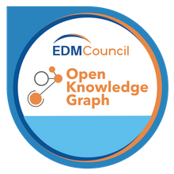

# Integrated Development Environment for Ontologies

# Table of contents

* [Use case development](#use-case-development)

# Introduction

EDMC OKG presents the Integrated Development Environment for Ontologies (IDEO)... It is based on and is a generalizaton of FIBO BTDM methodology descibed in [FIBO_BTDM.docx](./etc/site/fibo/doc/FIBO_BTDM.docx)

IDEO for modular ontologies...

.. move through a rigorous process and become available to the industry.  

## IDEO Process
This section discusses the IDEO based on GitHub, Ontology Publisher, and Jenkins being its core components.

GitHub, which is the primary repository for all content including the RDF/OWL files, documentation, use cases, test data, schedules, and more. GitHub manages an ontology which resides on a variety of virtual servers under EDMC namespaces herein referred to as the EDMC Website which is resident as an Amazon Web Service (AWS).  

Jenkins is the primary FIBO Continuous Integration (CI) platform. ss allows automation of the testing process by executing standard test scripts. Go here for details.

1)	A FIBO Content Team is formed as described above and selects one or more Domains that are in the GitHub Repository at any maturity level. The FIBO is modified as necessary according to the process of Section 3.2.2.  Proceedings are recorded in the Team’s Wiki.  Issues may be discovered and are recorded in EDMC JIRA for management.  Some issues are corrected manually.  Use Case data, developed by the FCT, is used to test the FIBO through the automation provided by Jenkins. This loop continues until relevant issues are resolved.

2)	When Jenkins testing through reasoners returns no errors this means that test scenarios provided by the FCT are positively concluded – EDMC JIRA has no unresolved FIBO content issues. The FIBO can be validated with SMEs and integrated with other FCT’s. 

3)	FIBO perhaps has additional issues discovered during validation and integration. FIBO content issues discovered are referenced to EDMC JIRA where they are adjudicated in EDMC GitHub/Jenkins. This loop continues until all relevant JIRA issues are resolved.  See the GitHub section below for the discussion on disposition of FIBO Maturity Levels.

4)	When all issues of all types are resolved, the FIBO Leadership Team approves the FIBO for publication as Production 
